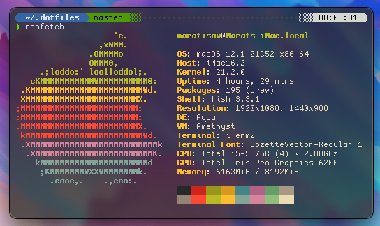
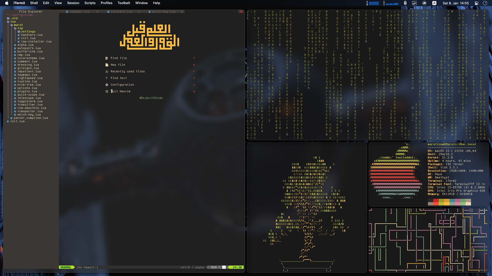
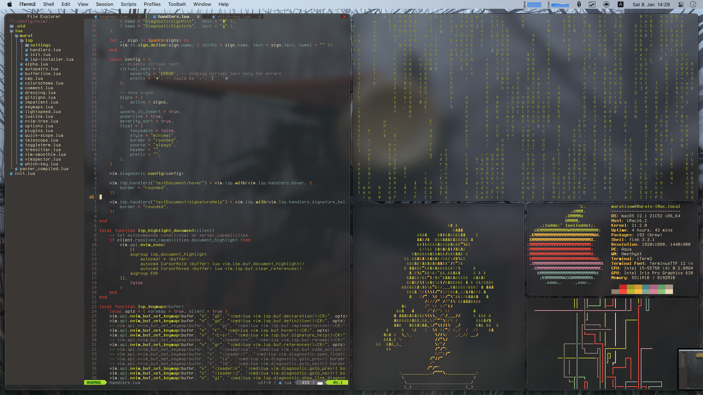

# My dotfiles

Dotfiles mostly for [neovim](https://neovim.io/), [fish](https://fishell.com) and [tmux](https://github.com/tmux/tmux/wiki)

Current color scheme of choice: [gruvbox](https://github.com/morhetz/gruvbox)

Other cool color schemes: 
 * [Cattpucin](https://github.com/catppuccin)
 * [Onedark](https://github.com/navarasu/onedark.nvim)

Fonts:
 * [Terminus](https://files.ax86.net/terminus-ttf/)
   * For mac: [Terminus ttf](https://files.ax86.net/terminus-ttf/)
 * [Cozette](https://github.com/slavfox/Cozette)
 * Various [Nerd Fonts](https://www.nerdfonts.com/) for icons

## Screenshots







## Installation

If you are me or really like my dotfiles and want to install them,
you will need GNU stow, once installed, follow these steps[^1]:

```sh
# clone repo
git clone https://github.com/xyl1t/.dotfiles.git
cd .dotfiles
# install dotfiles
stow -vt ~ */
```
[^1]: Assuming you are on macOS/Linux

